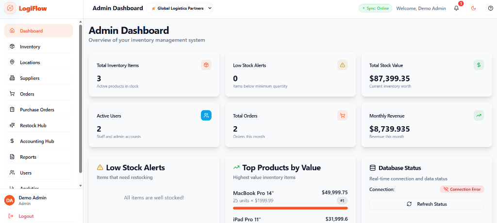
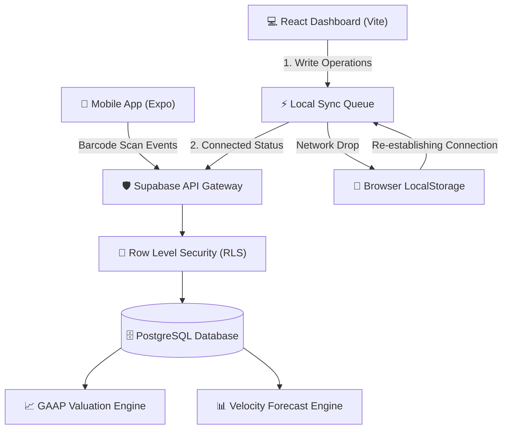

<p align="center">
  
</p>

<p align="center">
  
  
  
  
  
</p>

# LogiFlow Hub 🪐

LogiFlow Hub is a premium, dark-mode-first, enterprise-grade inventory intelligence and logistics orchestration platform. Built with a custom **Volt Orange & Electric Cyan** color system, it delivers a high-contrast dashboard aesthetic optimized for rapid operations.

The project is fully modular, type-safe, resilient to offline network drops, GAAP compliant, and includes a **React Native (Expo)** companion mobile app for on-the-floor warehouse scanning.

---

## 🏗️ System Architecture

This flow diagram illustrates how LogiFlow Hub orchestrates local state, offline synchronization, and multi-tenant isolation across the platform:



---

## 🛠️ Key Enterprise Systems

All core modules of the LogiFlow Enterprise roadmap have been successfully implemented and integrated:

### 🏢 1. Multi-Tenant SaaS Scoping
- Scopes profiles, catalogs, locations, and transactions dynamically by active `organization_id`.
- Features an organization selector dropdown in the header to switch active tenants instantly.
- Enforces data security boundaries via multi-tenant PostgreSQL Row Level Security (RLS) rules.

### 📴 2. Offline-Resilient Sync Queue
- Automatically intercepts database write errors and network drops, serializing transactions in a local storage queue.
- Reconciles the database sequentially once the browser detects restored connectivity.
- Displays a glowing connection status badge in the header:
  - <kbd>🟢 Connected</kbd> • Online and active.
  - <kbd>🟡 Reconciling</kbd> • Syncing offline cache.
  - <kbd>🟠 Pending Queue</kbd> • Cached local changes.
  - <kbd>🔴 Offline</kbd> • Disconnected.

### 📈 3. GAAP Compliant FIFO Accounting Ledger
- Computes inventory valuation ledgers using the First-In-First-Out (FIFO) costing method.
- Dedicates oldest stock batches first on item removals to calculate precise Cost of Goods Sold (COGS).
- Displays side-by-side comparison tables mapping Average Projections vs. FIFO valuations and audit variances.

### 🔔 4. Smart Notification Drawer
- Generates real-time alerts based on low safety stock levels, incoming purchase dispatches, and ledger sync states.
- Incorporates a **Web Audio API** synthesizer that issues a soft triangle-wave chime alert for low-stock warnings on page load.
- Features a dropdown notifications drawer with action endpoints that route users directly to relevant control panels.

### 📊 5. Predictive Run-out Velocity Forecasting
- Computes average consumption velocity (`removals / timeRange` days) for each product based on historical transaction logs.
- Projects days of supply remaining with color-coded alerts:
  - 🔴 **Critical** (<= 10 days remaining)
  - 🟡 **Warning** (<= 30 days remaining)
  - 🟢 **Safe** (> 30 days remaining)
- Plots a projected 30-day stock depletion path (`Quantity - Velocity * Day`) for top critical items on a custom Recharts Line Chart.

### ⚙️ 6. Automated Restock Hub
- Offers a safety-stock multiplier slider to scale reorder quantities dynamically.
- Runs a suggestion engine that highlights products below minimum limits, letting admins check and dispatch bulk draft Purchase Orders in one click.

### 💼 7. Supplier Portal & Shipping Timeline
- A dedicated dashboard for vendor accounts to manage incoming POs, declare shipping carrier and tracking IDs, and manage catalog unit pricing.
- Renders an interactive shipping timeline tracker (Draft Approval ➡️ Ordered ➡️ In Transit ➡️ Delivered) with client-side SMTP invoice dispatch simulation.

### 📷 8. Integrated Barcode Scanning
- Activates device camera viewport with scanning laser line animation loops.
- Synthesizes audio beep feedbacks on successful scans and triggers automated item edits or stock updates.

### 💵 9. Financial Integration Sync
- Computes Cost of Goods Sold (COGS) dynamically across transaction logs.
- Exports formatted valuation lists matching QuickBooks Online (Inventory Valuation) and Xero (Bills/Accounts Payable) CSV schemas.

### 📱 10. Mobile Companion Hub
- React Native companion app located in `/mobile`, built with Expo SDK 51, providing a synced mobile experience.

---

## 📁 Repository Layout

```
├── mobile/                   # React Native Expo Mobile Companion App
├── supabase/
│   └── migrations/           # PostgreSQL Schema DDL Migrations
├── src/
│   ├── components/
│   │   ├── accounting/       # Financial metrics, FIFO grids, & CSV Exporters
│   │   ├── analytics/        # Restock suggested grids & depletion line charts
│   │   ├── inventory/        # Camera scan overlays & inventory grids
│   │   └── layout/           # Shared sidebars & header bell alert drawer
│   ├── hooks/                # Supabase Auth, PO events, and Locations allocation hooks
│   └── pages/                # Landing views and dashboard shells
```

---

## 🚀 Quick Start

### 1. Web Application Setup

```bash
# Clone the repository
git clone https://github.com/Hubrisdog/logiflow-hub.git
cd logiflow-hub

# Install dependencies
npm install

# Start the Vite development server
npm run dev
```
The application will launch on your local host at `http://localhost:8080/`.

### 2. Mobile Companion Setup (Expo)

```bash
# Navigate to the mobile app directory
cd mobile

# Install dependencies
npm install

# Launch the Expo bundler
npx expo start
```
* Press **`w`** to open inside your local browser.
* Scan the console QR code using the **Expo Go** application on your physical device.

---

## 📊 Database Schema DDL

The PostgreSQL database is managed via Supabase. Apply the migration scripts in the `/supabase/migrations/` directory in the following order:
1. **Multi-Location Inventory & POs:** `20260530000000_phase1_enterprise.sql`
2. **Supplier Dispatch & Logistics:** `20260530000100_phase2_automation.sql`
3. **SaaS Multi-Tenancy & RLS:** `20260531000000_phase6_saas_multi_tenant.sql`

---


## 🗺️ Product Roadmap

### Phase 1: Inventory Foundation (Completed)
- [x] Multi-Tenant SaaS Scoping via RLS
- [x] FIFO Accounting Engine for precise COGS
- [x] Offline Sync Queue caching
- [x] Device-Native Barcode Scanning
- [x] Mobile Companion Hub (Expo)

### Phase 2: Warehouse Operations (Current Focus)
- [ ] **Role-Based Access Control (RBAC):** Granular permission boundaries mapped at the DB level.
- [ ] **Real-Time State Sync:** Migrating low-stock alerts to native WebSockets via Supabase Realtime.
- [ ] **Multi-Warehouse Rebalancing:** Authorized stock movements between physical locations.
- [ ] **Integration Test Coverage:** Automated testing for the offline queue to guarantee zero out-of-order execution.

### Phase 3 & 4: Automation & Logistics (Planned)
- [ ] Consumption Velocity Forecasting via edge functions.
- [ ] Automated Purchase Order Drafting.
- [ ] Carrier Tracking API Integrations.
- [ ] Bulk Delivery Dispatch workflows for fleet drivers.

*Built by [Hubris](https://github.com/Hubrisdog)*
